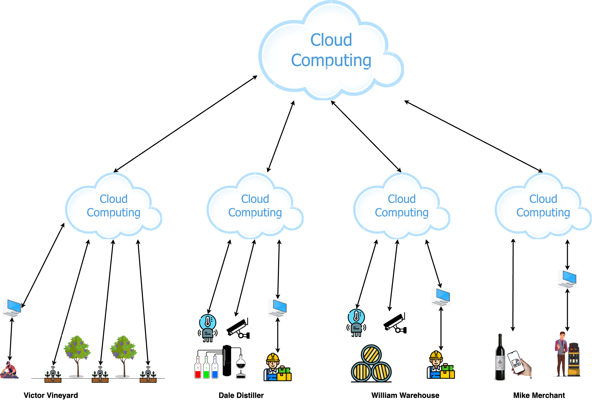

# Overview

`Mengawas` showcases the process of developing solutions to support and optimise the wine-making supply chain. A supply chain is a network of participants involved in the production, processing, and delivery of a product.

## Project Background

The wine-making process consists of several essential stages (see Figure 1).

  
**Figure 1: Basic Wine-Making Steps ([Image source](https://finding.wine/blogs/blog-posts/basic-steps-of-the-winemaking-process))**

From a supply chain perspective, the process consists of these stages: harvesting, processing, bottling, distribution, and selling (see Figure 2). For simplicity, juice extraction, fermentation, pressing, filtration, and aging are grouped into a single stage called `processing`, as these steps are typically interrelated. Transportation connects these stages, moving both intermediate and final products, forming the production chain.

Alongside the production chain is the regulatory chain, which ensures compliance with regulations and quality standards.

The third component is the support chain, responsible for providing equipment (e.g., barrels, bottles) and services that enable the production chain to operate smoothly.

  
**Figure 2: The Wine-Making Supply Chain**

## Project Scope and Deliverables

The current project scope includes the following participants in the supply chain:

- [Dale Distiller](./docs/delta.md): Juice extraction, fermentation, pressing, filtration, aging, and bottling.  
- [Mike Merchant](./docs/mike.md):  Final product seller.  
- [Victor Vineyard](./docs/victor.md): Grape supplier.
- [William Warehouse](./docs/william.md): Warehouse.

The objective is to deliver a track and trace solution using Internet of Thing (IoT) over the supply chain based on an architecture shown in Figure 3.

  
**Figure 3: Track and Trace**

For detailed description of the solution architecture please refer to [detailed design](./docs/solution.md).

## Disclaimer

`Mengawas` is provided as-is, without any guarantees or support. This project is for demonstration purposes only not intended for production or mission-critical systems. Users of the project shall assume all risks associated with its use.

The project is subject to change without notice, with modifications initiated and implemented at the sole discretion of its contributors.

The contributors to this project shall not be held liable for any damages, losses, or issues arising from its use. Developers are encouraged to thoroughly test and evaluate the library in their own environments before incorporating it into their applications. Where necessary, developers are advised to fork or clone the project and modify it to meet their specific needs.

## Copyright

Unless otherwise specified, this project is copyrighted as follows:

Copyright 2024 The Contributors to `Mengawas`

Licensed under the Apache License, Version 2.0 (the "License"); you may not use this file except in compliance with the License. You may obtain a copy of the License at:

    http://www.apache.org/licenses/LICENSE-2.0

Unless required by applicable law or agreed to in writing, software distributed under the License is distributed on an "AS IS" BASIS, WITHOUT WARRANTIES OR CONDITIONS OF ANY KIND, either express or implied. See the License for the specific language governing permissions and limitations under the License.

Please refer to the CONTRIBUTORS file for a list of contributors or the repository's commit history.