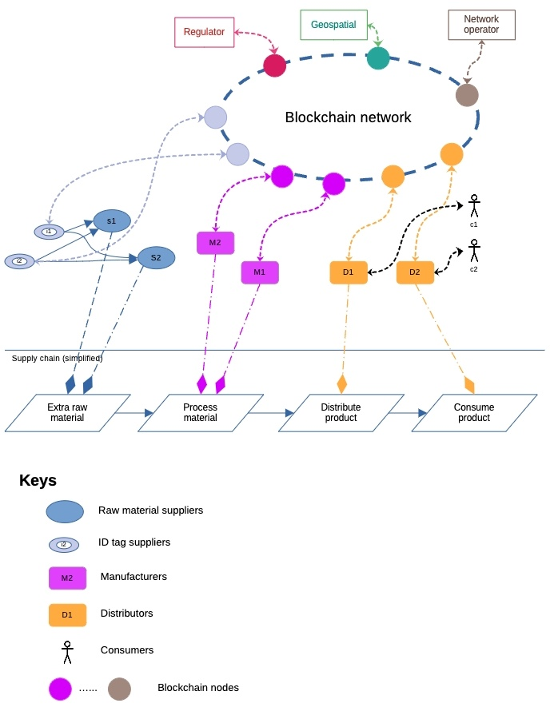

# Overview

This is a **educational** project to demonstrates a blockchain-based technologies a commpanying technological stacks networked in a way to support a hypothethical supply chain use case.

## Project context

Here is the **hypothetical** supply chain network.

<u>Figure 1: A hypothetical blockchain network</u>

Here we have a simplistic supply chain where we have raw materials (i.e. iron ore, aluminum, etc) get process into products that are sold to consumers. 

Directly in this chain are types of organisations:

* ID tags providers (i1 and i2);
* Raw materials suppliers (S1 and S2);
* Manufacturers (M1 and M2);
* Product distributors (D1 and D2);
* Product consumers (C1 and C2);

Not directly in the supply chains are:

* Regulators;
* Data analytic company (e.g. Geosptial);
* Blockchain network operations.

All of these participants are assigned a Blockchain node (Geth, Fabric client, Wallet, etc). These are designated Blockchain participants.

<u>Participant roles</u>

**ID tags providers** sell id tags (e.g. NFC, barcodes, QR codes, etc) to raw materials suppliers. They also provide tag scanners to other members of the supply chain. When members use the scanner data is uploaded to the blockchain network. There could be multiple ID providers selling their own wares but as long as they share data on their blockchain network, all members of the network can easily use any ID providers.

**Raw materials suppliers** extract the necessary raw materials for transfer to manufacturers. The suppliers tags the material, updates information about the materials they plan to ship and upload data to the blockchain.

> NOTE:
> In cases, where there is potential for fraud, such as supplier uploading fake data, additional data could be obtained independently, for example, in the case of Figure 1, a Geospatial company could capture the location of raw material and perform, for example, geological analysis and upload to the blockchain network. Thus we can obtain information about a product from multiple decentralised data points. The other data points could act as witness to a single event.

**Manufacturers** job is to transform raw materials to manufactured products. They can scan tag from raw material supplier to verify its origin. 

> NOTE:
> In the case of high value products where provenance of raw material is very important, the manufacturers might not just rely on information uploaded by the suppliers. It could corroborate with Geospatial company -- e.g. in the case of car batteries, cotton wool, etc -- to cross check information.

Unless the product has a simple Bill-of-Material (BoM), it is rare for a manufactured product to derived directly from raw materials. Chances are there will be intermediate manufacturing processes. In reality there will be a mini-supply chain amongst suppliers.

**Distributors** buys and sells the product. The distributors may also provide apps for consumers of the product. The apps could function as a *product passport* enabling consumer to see the product information from source to endpoint.

>NOTE: It is also possible a dedicated product passport company might provide access to the blockchain network to consumers. By separating it out from the distributors consumers could be assured that the passport comes from different participants from the distributor. We could even have multiple passport providers to ensure no cheating.

**Consumers** who wants to know about the product used apps to scan identifiers to provide obtain information about the product.

**Regulators** are responsible to ensure the provenance of the data about the product over its supply chain. It is tapped into the blockchain via its own node.

**Network operators** role is to provide the enabling technologies for all the blockchain participants.

This participant is unique, its only purpose is to ensure that blockchain protocol works. To ensure that the network is the neutral participant it should not have a direct involvement in the supply chain. There are many ways of ensuring that:

* The network operator could be an independent entity providing the technologies in an open source way.
* The network operator could be form from a consortium consisting of members in the supply chain ensuring no single party has control over the shaped of the technology.
* The network operator could be in the form of a foundation such as Hyperledger or Ethereum foundation where they co-ordinate the technological specification of the network and leave it to others to implement the necessary multiple solution.

## Objective of this Project

The contributor of this project is performing the role of a Network Operator. The object of this project is to create tools to orchestrate the blockchain network for four types of entities in a hypothetical supply chain using different blockchain technologies. 

## Disclaimer

* The content of this project is intended for educational purpose only.
* The content is constantly updated and items may be removed and modified without warning.

## Copyright

Unless otherwise specified, the copyright in this project are assigned as follows.

Copyright 2023 Paul Sitoh

Licensed under the Apache License, Version 2.0 (the "License"); you may not use this file except in compliance with the License. You may obtain a copy of the License at

http://www.apache.org/licenses/LICENSE-2.0
Unless required by applicable law or agreed to in writing, software distributed under the License is distributed on an "AS IS" BASIS, WITHOUT WARRANTIES OR CONDITIONS OF ANY KIND, either express or implied. See the License for the specific language governing permissions and limitations under the License.