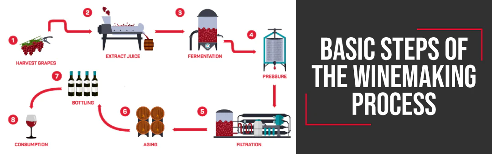
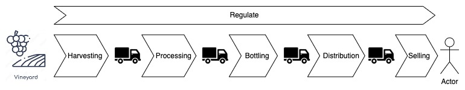

# Overview

This is a **educational** project that demonstrates the application of blockchain-base technologies to support wine-making supply chain.

This project is presented from the perspective of a fictional company with a mission to help businesses form networks by leveraging on blockchain technologies. The narrative is presented from the viewpoint of a fictional company with the sole mission of assisting businesses in forming networks through the utilization of blockchain technologies. In instances where pronouns such as `we,` `our,` and `us` are used, they specifically refer to the fictional company. It is crucial to note that this fictional entity operates solely as a technology provider and is not a participant in the supply chain itself.

For clarity and focus on problem-solving steps within the project, fictional entities, including countries (`Atlantis,` `Wakanda,` etc.), companies, and personas, have been introduced. This deliberate use of fictional elements aims to prevent distractions that might arise from the association with real-world entities, allowing a more concentrated exploration of the project's problem-solving methodologies.

## Context

The basic steps involved in wine making process is summarised in Figure 1.

 
**Figure 1: Basic Wine Making Steps (see [Image source](https://finding.wine/blogs/blog-posts/basic-steps-of-the-winemaking-process))**

Examining the supply chain (refer to Figure 2), the process encompasses key stages: harvesting, processing (involving juice extraction, fermentation, pressure, filtration, and aging), bottling, distribution, and selling. Transportation serves as the bridge between these stages, facilitating the movement of intermediate and final products.

Simultaneously, a regulatory chain runs parallel to the physical supply chain. Its primary role is to ensure compliance with regulations, particularly in areas such as health and safety, at every stage of the physical chain.

 
**Figure 2: The supply chain**

### What problems are we trying to solve?

`Alantis` is a famous wine making country. However, the country's wine making supply chain is dominated by a single company, name `Acme`, which control the processing, bottling and distribution of wines. `Acme` also owns a vineyard and its chain of pubs. `Wakanda` a major importer of `Atlantis` wines is also dissatisfied with the dorminance of `Acme`. Together with the supply chain participants in `Atlantis`, `Wakanda` lodge a complain to the `World Trading Body`.

The `World Trading Body` came to a judgement and ruled that `Alantis` must reform the wine supply chain make it more competitive. Allowing for more participants to participate in the supply chain.

For a detailed analysis of the challenges of the wine supply chain we produced a report titled ["Tides of Complexity: Examining the Supply Chain Challenges in Atlantis"](./docs/challenge.md) for the `Atlantis` government.

### A proposed solution

The `Atlantis` government enlisted our expertise to address their challenges, leading us to propose a blockchain-based solution. The rationale for this proposal is comprehensively outlined in our report titled ['Transforming Atlantis Wine Supply Chain: A Blockchain Solution.'](./docs/solution.md) In essence, the benefits of adopting blockchain technology in this context are:

* Facilitating peer-to-peer transactions among supply chain participants.
* Creating a network effect to enable economies of scale for participants while maintaining their independence to prevent anti-competitive practices.
* Providing regulatory bodies with enhanced oversight, enabling swift intervention in case of malpractices.
* Enhancing overall supply chain efficiency.

### Implementation roadmap

The implemention of our solution is discussed in our [roadmap](./docs/roadmap.md)

## Disclaimer

* The content of this project is intended for educational purpose only.
* The content is constantly updated and items may be removed and modified without warning.

## Copyright

Unless otherwise specified, the copyright in this project are assigned as follows.

Copyright 2023 Paul Sitoh

Licensed under the Apache License, Version 2.0 (the "License"); you may not use this file except in compliance with the License. You may obtain a copy of the License at

http://www.apache.org/licenses/LICENSE-2.0
Unless required by applicable law or agreed to in writing, software distributed under the License is distributed on an "AS IS" BASIS, WITHOUT WARRANTIES OR CONDITIONS OF ANY KIND, either express or implied. See the License for the specific language governing permissions and limitations under the License.