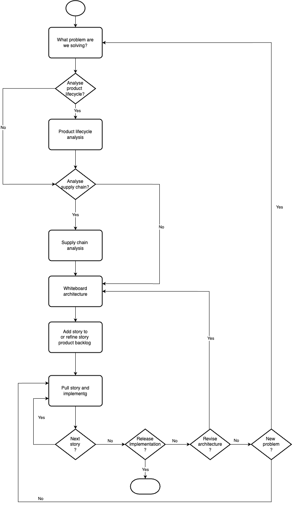

# Mengawas: Optimizing the Wine-Making Supply Chain (Educational Project)

`Mengawas` is an educational project demonstrating the process of developing solutions for supply chain challenges. It uses a simulated wine-making process as a case study to illustrate key concepts and development stages.

## Development Lifecycle

`Mengawas` follows a simplified development lifecycle, as summarized in Figure 1, to demonstrate the process of moving from problem definition to a potential solution.

<figure>
  
  <figcaption>Figure 1: Mengawas Development Lifecycle.</figcaption>
</figure>

The results of each stage in the `mengawas` development lifecycle are presented in the following documents:

* [What problems are we solving?](./docs/solution.md#what-problem-are-we-solving)
* [Product lifecycle analysis](./docs/product_life.md) (Wine-making focus)
* [Supply chain analysis](./docs/supply_chain.md)
* [Whiteboard Architecture - Options](./docs/solution.md#whiteboard-architecture---options)
* [Product Backlogs](./docs/solution.md#product-backlogs)

> **NOTE:**
> 1.  This project uses a simplified development lifecycle and wine-making case study for educational purposes.  While the core steps are applicable to other supply chain scenarios, the level of detail is reduced for clarity.
> 2.  The intermediate steps, such as translating a high-level architecture to a detailed product backlog, are not explicitly shown in this project.
> 3.  The findings presented in product lifecycle analysis, supply chain analysis and solution architect are simplified but in real work project these documente would be constantly evolving and synchronised to user stories.

## Disclaimer

`Mengawas` is provided "as-is," without any warranties or support. This project is for demonstration purposes only and is not intended for production or mission-critical systems. Users assume all risks associated with its use.

The project is subject to change without notice, at the sole discretion of the contributors.

The contributors shall not be liable for any damages, losses, or other issues arising from the use of this project. Users are encouraged to thoroughly test and evaluate `Mengawas` in their own environments before incorporating it into any applications. Forking or cloning the repository and adapting it to specific needs is also recommended.

## Copyright

Copyright 2025 The Mengawas Contributors

Licensed under the Apache License, Version 2.0 (the "License"); you may not use this file except in compliance with the License. You may obtain a copy of the License at

    http://www.apache.org/licenses/LICENSE-2.0

Unless required by applicable law or agreed to in writing, software distributed under the License is distributed on an "AS IS" BASIS, WITHOUT WARRANTIES OR CONDITIONS OF ANY KIND, either express or implied. See the License for the specific language governing permissions and limitations under the License.

A list of contributors can be found in the CONTRIBUTORS file or by reviewing the repository's commit history.