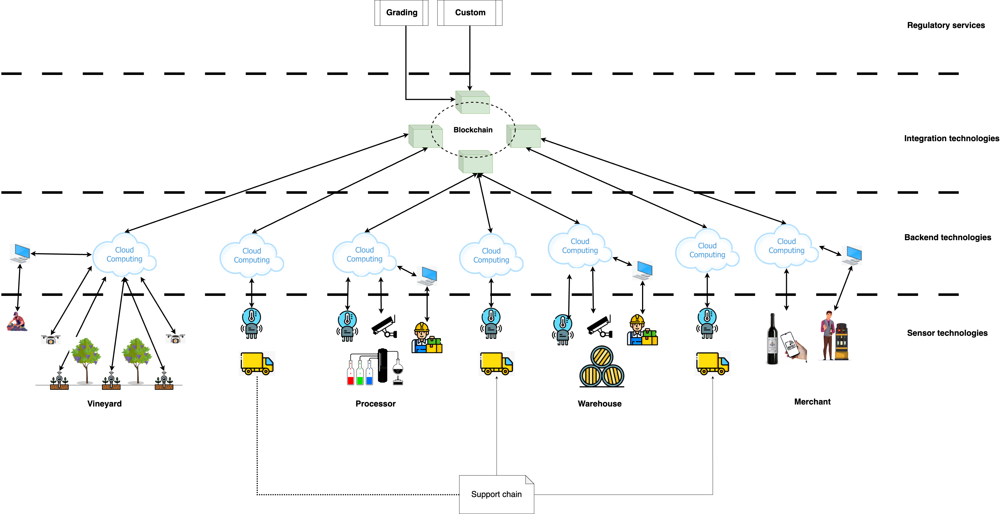

# Mengawas: Optimizing the Wine-Making Supply Chain

Mengawas is a project demonstrating the development of solutions to support and optimize the wine-making supply chain.

## Project Background

The wine production process, as summarized in Figure 1, highlights the critical importance of lifecycle integrity for final product quality.

<figure>
  
  <figcaption>Figure 1: Basic Wine-Making Steps. <em>Source:</em> [https://finding.wine/blogs/blog-posts/basic-steps-of-the-winemaking-process](https://finding.wine/blogs/blog-posts/basic-steps-of-the-winemaking-process)</figcaption>
</figure>

Key data points for ensuring product quality are detailed [here](./docs/product_life.md).

While some wineries manage the entire process from harvest to direct sales (as seen in Figure 1), the wine industry often involves a complex supply chain with multiple participants. A detailed analysis of the supply chain is [here](./docs/supply_chain.md).

## Project Goals and Challenges

Wine supply chain participants face several significant challenges, including:

* **Climate Change:**  Increasingly unpredictable weather patterns lead to fluctuating yields and impact grape quality.
* **Regulatory Compliance:**  Meeting evolving regulatory demands adds complexity and cost to the production process.
* **Information Silos:**  The decentralized nature of the industry often results in fragmented information sharing, hindering collaboration and traceability.

The goal of Mengawas is to develop a solution that addresses these challenges, improving efficiency and transparency across the wine-making supply chain.

## Project Scope and Deliverables

Mengawas aims to deliver a track and trace solution leveraging the Internet of Things (IoT) across the supply chain. The proposed architecture for this solution is depicted in Figure 3.

<figure>
  
  <figcaption>Figure 3: Proposed IoT-based Track and Trace Solution Architecture</figcaption>
</figure>

Please refer [here](./docs/solution.md) for a detailed description of the solution architecture.

## Disclaimer

Mengawas is provided "as-is," without any warranties or support. This project is for demonstration purposes only and is not intended for production or mission-critical systems. Users assume all risks associated with its use.

The project is subject to change without notice, at the sole discretion of the contributors.

The contributors shall not be liable for any damages, losses, or issues arising from the use of this project. Users are encouraged to thoroughly test and evaluate Mengawas in their own environments before incorporating it into any applications. Forking or cloning the repository and adapting it to specific needs is also recommended.

## Copyright

Copyright 2024 The Mengawas Contributors

Licensed under the Apache License, Version 2.0 (the "License"); you may not use this file except in compliance with the License. You may obtain a copy of the License at

    http://www.apache.org/licenses/LICENSE-2.0

Unless required by applicable law or agreed to in writing, software distributed under the License is distributed on an "AS IS" BASIS, WITHOUT WARRANTIES OR CONDITIONS OF ANY KIND, either express or implied. See the License for the specific language governing permissions and limitations under the License.

A list of contributors can be found in the CONTRIBUTORS file or by reviewing the repository's commit history.