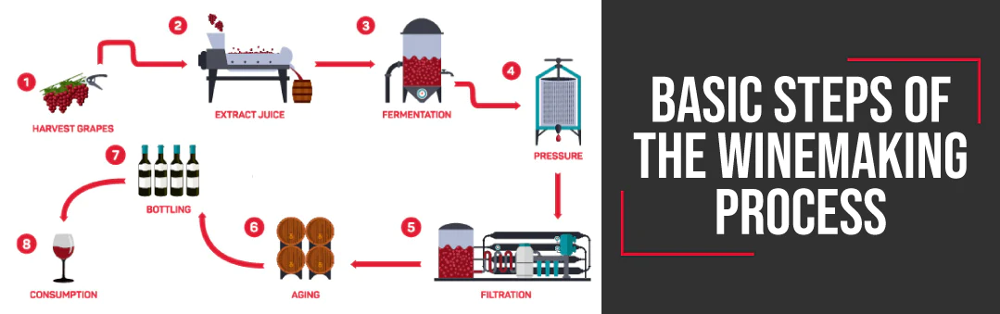
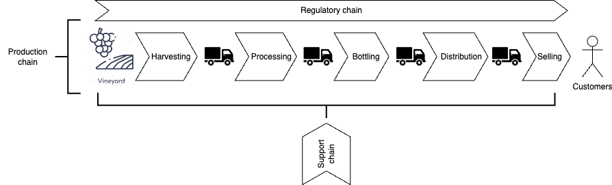

# Overview

This project demonstrates the use of peer-to-peer technologies, such as Blockchain, to support and enhance the wine-making supply chain. A supply chain refers to a network of participants involved in the production and delivery of a product.

## What does the wine-making supply chain look like?

The wine-making process consists of several essential stages (see Figure 1).

  
**Figure 1: Basic Wine-Making Steps ([Image source](https://finding.wine/blogs/blog-posts/basic-steps-of-the-winemaking-process))**

From a supply chain perspective, the process can be broken down into key stages: harvesting, processing, bottling, distribution, and selling (see Figure 2). For simplicity, juice extraction, fermentation, pressing, filtration, and aging are grouped into a single stage called `processing`, as these steps are typically interrelated. Transportation connects these stages, moving both intermediate and final products, forming the production chain.

Alongside the production chain is the regulatory chain, which ensures compliance with regulations and quality standards.

The third component is the support chain, responsible for providing equipment (e.g., barrels, bottles) and services that enable the production chain to operate smoothly.

  
**Figure 2: The Wine-Making Supply Chain**

## Project Scenario

In this project, we begin with a supply chain that lacks peer-to-peer infrastructure. The following participants are identified as the "genesis" entities within the supply chain:

- [Delta Distiller](./docs/delta.md): Handles juice extraction, fermentation, pressing, filtration, aging, and bottling.  
- [Gerrard Grader](./docs/gerrard.md): Independent organization responsible for wine grading.  
- [Mike Merchant](./docs/mike.md): Retailer of the final product.  
- [Sierra Sensors](./docs/sierra.md): Provides sensor and satellite imagery services.  
- [Victor Vineyard](./docs/victor.md): Grape supplier.

Each of these participants operates as an independent node within the supply chain, with its own platform. For more details on their respective platform requirements, please click on the links above.

The genesis participants must share information without relying on intermediaries to coordinate their actions. The network is designed to be extensible, allowing new participants (non-genesis entities) to join with minimal barriers or complex configurations.

Additionally, there is a non-participant in the supply chain, referred to as "we" or "Mengawas." Mengawas are the contributors responsible for building the platform that enables supply chain participants to interact with each other. The role of Mengawas and the supply chain network architecture is detailed [here](./docs/mengawas.md).

## What does this project aim to demonstrate?

This project aims to demonstrate an alternative approach to centralized systems commonly found in industries such as ride-hailing services, where a central entity mediates interactions between participants. Instead, this project will show that supply chain participants can operate more efficiently through a peer-to-peer network, eliminating the need for intermediaries.

## Disclaimer

- This project is for demonstration purposes only.  
- The entities mentioned are fictional, and any resemblance to real entities is purely coincidental.  
- Content is subject to updates, and items may be removed or modified without prior notice.

## Copyright

Unless otherwise specified, the copyright for this project is assigned as follows:

Copyright 2023 Paul Sitoh

Licensed under the Apache License, Version 2.0 (the "License"); you may not use this file except in compliance with the License. You may obtain a copy of the License at:

<http://www.apache.org/licenses/LICENSE-2.0>

Unless required by applicable law or agreed to in writing, software distributed under the License is provided "AS IS", without warranties or conditions of any kind. See the License for specific language governing permissions and limitations under the License.
