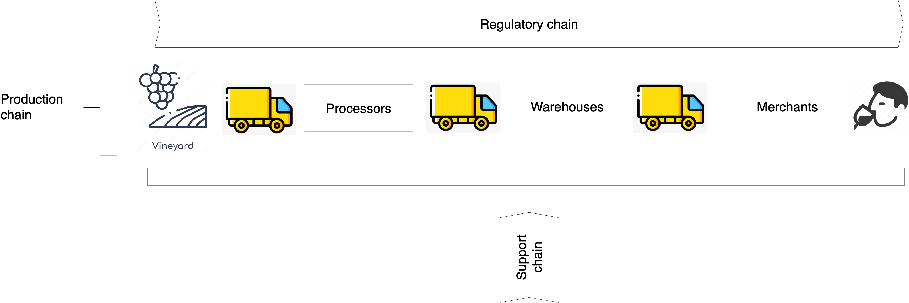

# Overview

This is a project to demonstrate a wine making supply chain leveraging on peer-to-peer technologies, such as blockchain, to enable the chain to be efficient.

## Context

The basic steps in the wine-making process is illustrated in Figure 1.

 
**Figure 1: Basic Wine Making Steps (see [Image source.](https://finding.wine/blogs/blog-posts/basic-steps-of-the-winemaking-process))**

From a supply chain perspective, the wine-making process consists of key stages: harvesting, processing, bottling, distribution, and selling (see Figure 2). We have grouped juice extraction, fermentation, pressing, filtration, and aging into a single stage called `processing`, as these steps are rarely performed independently. Transportation segments connect the supply chain stages, facilitating the movement of both intermediate and final products. We refer to this part of the supply chain as the production chain.

Running parallel to the production chain is the regulatory chain, which consists of participants responsible for ensuring that the production chain complies with regulations and quality standards.

The third component of the supply chain is the support chain, responsible for supplying equipment, such as casks and bottles, or services that enable the production chain to produce wine.

 
**Figure 2: The supply chain**

## Disclaimer

* The content of this project is intended for educational purposes only.
* The entities mentioned in this project are purely fictional, and any resemblance to real entities is purely coincidental.
* The content is constantly updated, and items may be removed and modified without warning.

## Copyright

Unless otherwise specified, the copyright in this project are assigned as follows.

Copyright 2023 Paul Sitoh

Licensed under the Apache License, Version 2.0 (the "License"); you may not use this file except in compliance with the License. You may obtain a copy of the License at

http://www.apache.org/licenses/LICENSE-2.0
Unless required by applicable law or agreed to in writing, software distributed under the License is distributed on an "AS IS" BASIS, WITHOUT WARRANTIES OR CONDITIONS OF ANY KIND, either express or implied. See the License for the specific language governing permissions and limitations under the License.