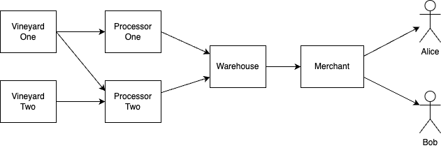

# `Mengawas`: A Simulated IoT, AI and DLT Powered Wine Making Supply Chain

This project simulates how IoT (Internet of Things), AI (Artificial Intelligence), and DLT (Distributed Ledger Technology) could optimise a wine-making supply chain, serving as a conceptual and educational case study rather than a production-ready implementation.

## Project Overview

`Mengawas` simulates a wine-making supply chain based on the process illustrated in Figure 1.

<figure>
  
  <figcaption>Figure 1: The wine making process.</figcaption>
</figure>

In real-world wine making, it is rare for a single entity to execute the entire process. Instead, multiple specialised entities collaborate, forming a supply chain as shown in Figure 2.

<figure>
  
  <figcaption>Figure 2: The wine making supply chain.</figcaption>
</figure>

> **NOTE**:
> `Mengawas` has identified a single entity (i.e. processor) performing the tasks of juice extraction, fermentation, pressing, and filtration. This simplification is for demonstration purposes only; in reality, these tasks could be handled by multiple entities.

For the purpose of the `Mengawas` case study, the identified supply chain participants are:

* **The product chain** – directly responsible for wine making (Figure 3):
  * **Vineyard One:** Supplies two grades of grapes (30% to Pete Processor for red wine and 70% to Petra Processor for white wine).
  * **Vineyard Two:** Supplies grapes exclusively to Petra Processor.
  * **Processor One:** Processes red wine grapes.
  * **Processor Two:** Processes white wine grapes.
  * **Warehouse:** Stores bottled wine.
  * **Merchant:** A wine merchant with exclusive distribution rights to consumers.
  * **Alice and Bob:** Consumers.
* **The support chain** – indirectly involved in wine making. For `Mengawas`, only **Transport** has been identified.
* **The regulator chain** – provides regulatory oversight. Two participants have been identified: **Wine Grader** and **Customs**.

<figure>
  
  <figcaption>Figure 3: The product chain.</figcaption>
</figure>

## Proposed Solution

Unlike business-to-customer applications, which cater to a relatively homogeneous set of end users, supply chain solutions must accommodate diverse participants with distinct operational requirements. A successful solution must address the specific needs of each stakeholder while ensuring interoperability across the chain.

`Mengawas` has identified key challenges confronting the wine-making supply chain:

* **Climate Change:** Increasingly unpredictable weather patterns lead to fluctuating yields and impact grape quality.
* **Information Silos:** The decentralised nature of the supply chain results in fragmented information sharing, hindering collaboration and traceability.
* **Varying Levels of Digitalisation:** Participants have different levels of competence and investment in digital technologies, making a one-size-fits-all solution impractical.

> **NOTE:**  
> These challenges are based on a limited sample of responses from industry experts and are highlighted purely for case study purposes.

To address these challenges, `Mengawas` proposes a solution integrating IoT and Blockchain to improve transparency, efficiency, and traceability across the supply chain (Figure 4).

<figure>
  
  <figcaption>Figure 4: The proposed solution.</figcaption>
</figure>

Key features include:
- **IoT sensors** to monitor grape quality, fermentation conditions, and transportation environments.
- **Blockchain integration** for tamper-proof record-keeping, ensuring transparency across participants.
- **Smart contracts** to automate compliance verification and streamline transactions.
- **Consumer-facing interface** to provide provenance tracking, allowing customers to verify wine authenticity and sustainability efforts.

The specific solutions for each participant are detailed in:

* [Vineyards](./docs/vineyard.md)
* [Processors](./docs/processors.md)
* [Warehouse](./docs/warehouse.md)
* [Merchants](./docs/merchant.md)
* [Consumers](./docs/consumers.md)

## Disclaimer

`Mengawas` is provided "as-is" without warranty or support. This project is for demonstration purposes only and is not intended for production systems. Users assume all risks associated with its use. The project is subject to change without notice. Contributors are not liable for any damages arising from the use of this project.

## Copyright

Copyright 2025 The `Mengawas` Contributors

Licensed under the Apache License, Version 2.0 (the "License"); you may not use this file except in compliance with the License. You may obtain a copy of the License at

  [http://www.apache.org/licenses/LICENSE-2.0](http://www.apache.org/licenses/LICENSE-2.0)

Unless required by applicable law or agreed to in writing, software distributed under the License is distributed on an "AS IS" BASIS, WITHOUT WARRANTIES OR CONDITIONS OF ANY KIND, either express or implied. See the License for the specific language governing permissions and limitations under the License.

A list of contributors can be found in the CONTRIBUTORS file or by reviewing the repository's commit history.
