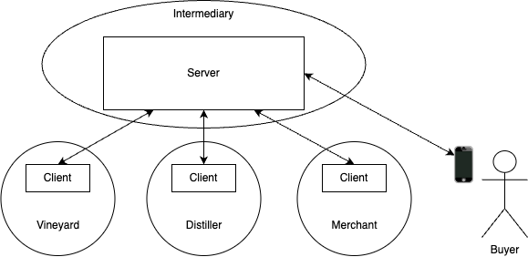
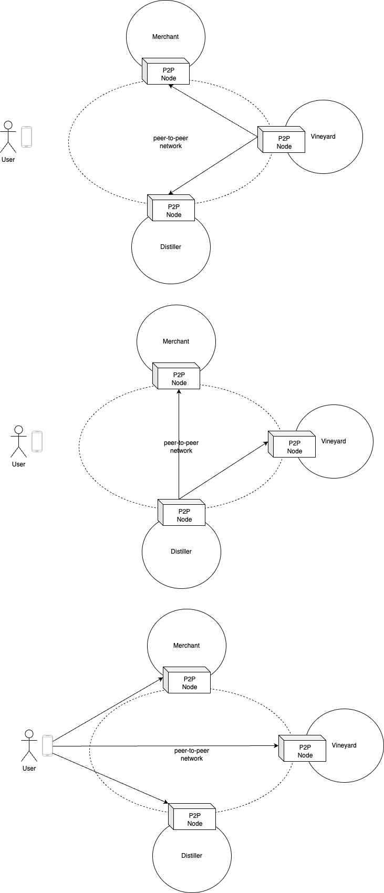
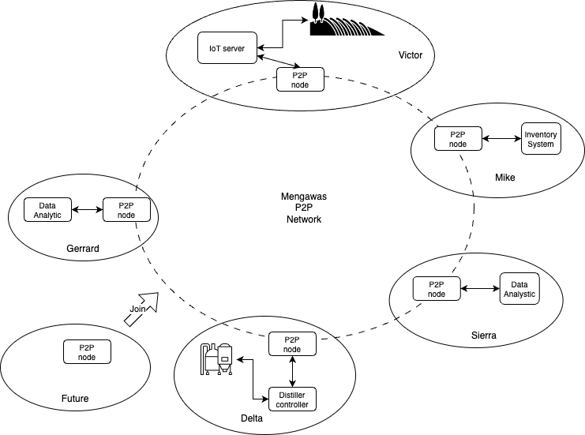
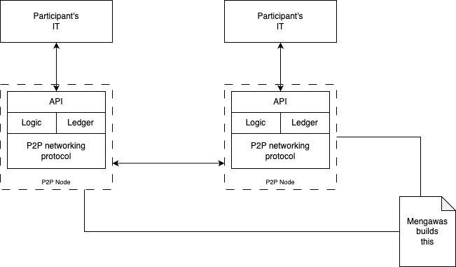

# Mengawas

Mengawas is responsible for creation and provision of computation nodes to the participants in the supply chain. There are two approach Mengawas could deliver a solution to the supply chain:

* Option 1 - As an intermediary
* Option 2 - Provide peer-to-peer nodes

We will examine the two options and explain why Mengawas has gone for a solution based on option 2.

## Option 1

Let's consider a simple supply chain consisting of four participants: a vineyard, a distiller a merchant, and a buyer of wine.

This option involves Mengawas as an intermediary proving a computational platform for all four participants to share information about the provenance of a bottle of wine over the lifecycle of the supply chain ending with a buyer as shown in Figure 1. 

  
**Figure 1: A client server supply chain solution**

The vineyard would upload information about grapes destined for the distiller to the server. The distiller will obtain information about the grapes from the distiller via the server and add more information, and upload to the server. The merchant would obtain information about the server. Likewise the buy of wine could obtain information about the product by connecting to the server.

This setup is similar to that found in ride hailing platforms such as Uber. The principal drawback with this system are:

* Each participant has no direct control over their data and control over whom they can share information.
* It is hard to size computational needs to each participant usage.
* The system is very expensive to scale when more participants join the network.

## Option 2

This option involves Mengawas providing computational platform that are taylored to a participant's requirement with a protocol for participants in the supply chain to share information. Mengawas does not operate as an intermediary. It provides computational platform known as a node, that can function as a client and a server. 

Participant use the node to communicate directly with other participants in the supply chain. 

As shown in Figure 2, the Vineyard communicate with the node its own, which in turns send message to other nodes, owned by the Merchant and the Distiller. There is no centralised database for all participants to hold data. Instead every participants maintain their own database. The databases are sychronised when participants message each other.

A key element of having an integrated supply chain is to enable participants have a view of the provenance of wine. With a peer-to-peer setup, all participants including buyers of wine can access information about the product from any nodes in the network and not reliant on one source.

  
**Figure 2: A peer-to-peer supply chain solution**

## What does Mengawas solution look like?

An overview of the Mengawas network is summarised in Figure 3.

**Figure 3: The Mengawas network**

Mengawas role is to provide the node where each participant will integrate with their respective IT solutions. 

**Figure 4: The Mengawas network**