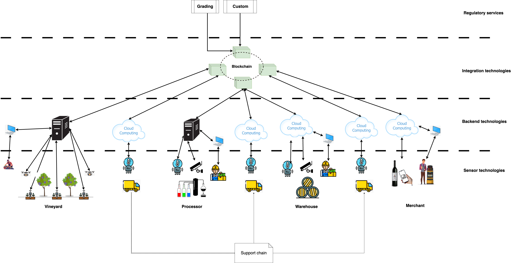

# Problem Definition, Whiteboard Architecture and Product Backlogs

This section describes the process `mengawas` followed to define the problem, explore potential solutions, and translate the chosen architecture into actionable product backlogs using a simulated wine making process to illustrate.

## Problem Definition

The first step in finding a solution to solve supply chain challenges is no different from any other software project, which is to appreciate the nature of the problem one is trying to solve. In the stage of the development lifecycle, the emphasis is to get a big picture of the challenges not to go into details.

For `mengawas`, the following challenges have been identified for the simulated wine making supply chain:

* **Climate Change:** Increasingly unpredictable weather patterns lead to fluctuating yields and impact grape quality.
* **Information Silos:** The decentralized nature of the supply chain results in fragmented information sharing, hindering collaboration and traceability.
* **Varying Levels of Digitalization:** Participants have different levels of competence and investment in digital technologies, making a one-size-fits-all solution inappropriate.

> **NOTE:**
> 1. For a real world supply chain scenarios, the recommended approach is to work with all stake holders in the supply chain to identify challenges.
> 2. Record the challenges in bulletpoints and make it accessible to all stakeholders.

Having identified the nature of challenges, perform the following steps:

* [Product lifecycle analysis](product_life.md).
* [Supply chain analysis](./supply_chain.md).

These steps provides details of the nature of the challenges.

## Solution Architecture Options

Having identified and detailed the nature of the challenges, identify potential solutions in broad terms. Produce whiteboard architecture.

> **NOTE:**
> 1. A whiteboard architecture is an exercise in painting a broad picture of options available. It is not intended to focus on a specific solution.
> 2. Whiteboard architecture design is often an iterative process. The chosen architecture may evolve as circumstances change, even during implementation. The option of pivoting to a completely new architecture should also be contemplated if extremely necessary from a commerical viability perspective.

For `mengawas`, having identified the challenges, it was decided to deliver a track and trace solution leveraging the Internet of Things (IoT) across the supply chain.  Two broad architectural options were considered:

* **Hub-and-Spoke Architecture:** (Figure 1)
* **Blockchain-Based Architecture:** (Figure 2)

<figure>
  
  <figcaption>Figure 1: Hub-and-Spoke Architecture</figcaption>
</figure>

**Hub-and-Spoke Architecture: Pros and Cons**

* **Pros:**
    * Can be managed by a single entity.
    * Follows a conventional three-tiered architecture (API, middleware, data).
* **Cons:**
    * Requires all participants to standardize on a single digital architecture.
    * Scaling can be challenging due to varying participant requirements.

<figure>
  
  <figcaption>Figure 2: Blockchain-Based Architecture</figcaption>
</figure>

**Blockchain-Based Architecture: Pros and Cons**

* **Pros:**
    * Well-suited for decentralized and independent participants.
    * Tokenization features offer participants options to monetize operations.
    * Supports peer-to-peer integration.
    * Customizable data security while facilitating data integration.
* **Cons:**
    * Does not follow a conventional three-tiered architecture.
    * May involve cryptocurrency, potentially complicating financing.

After analyzing the pros and cons of each option, `mengawas` selected the blockchain-based solution for implementation.  This choice aligns best with the decentralized and diverse nature of the wine supply chain.

> **NOTE:** 
> 1. For simplicity only two options are considered here.
> 2. In real world scenarios, several architectural options should be considered in a real-world scenario to avoid unnecessarily narrowing choice too early.

## Product Backlogs

Having considered and chosen the architecture to aim for, the next step is to identify the appropriate product backlog. For supply chain related scenarios where the participants are independent and may have its own existing digital infrastructure, assigning individual product backlogs is appropriate.

> **NOTE:** In this context, a product backlog is a collection of epics, user stories, and chores representing the features and functionality required by a particular entity.

In the case of `mengawas`, the following product backlogs were identified based on the chosen blockchain architecture. Each backlog represents deliverables for a specific supply chain participant:

* **Victor Vineyard**
* **Vicky Vineyard**
* **Pete Processor**
* **Petra Processor**
* **Wendy Warehouse**
* **Mike Merchants**
* **Tommy Transporter**
* **George Grader**
* **Chris Custom**
* **Consumers**

A separate product backlog was also created for the blockchain infrastructure itself.

[TO DO: Add links to resources on creating product backlogs and user stories]